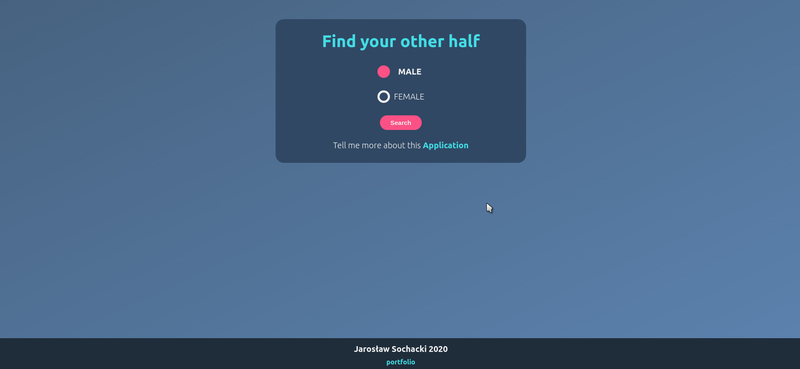
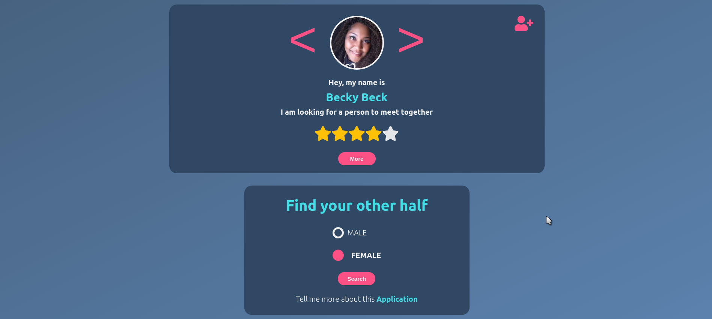
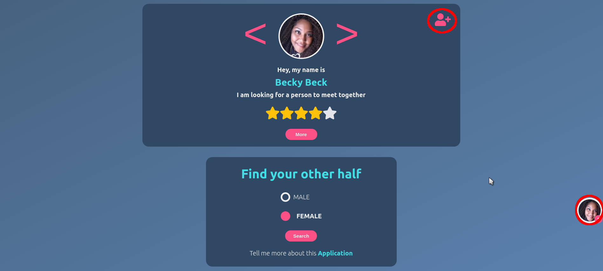
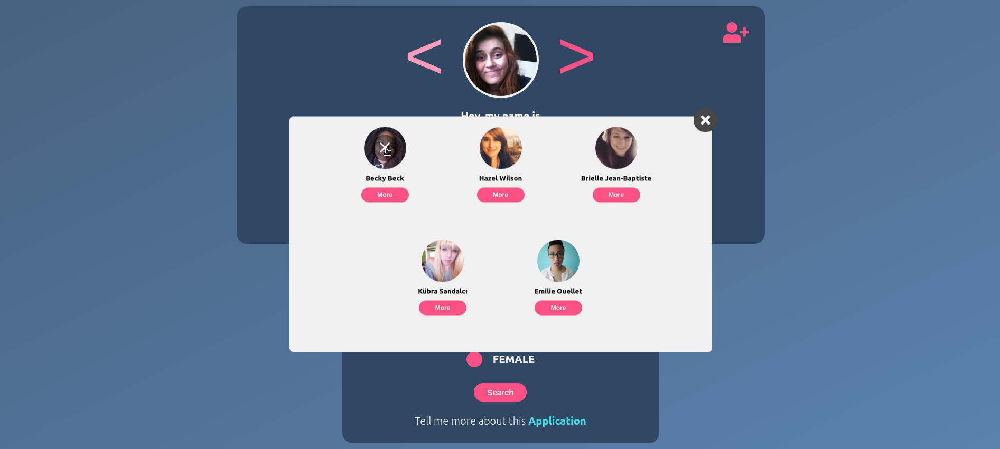
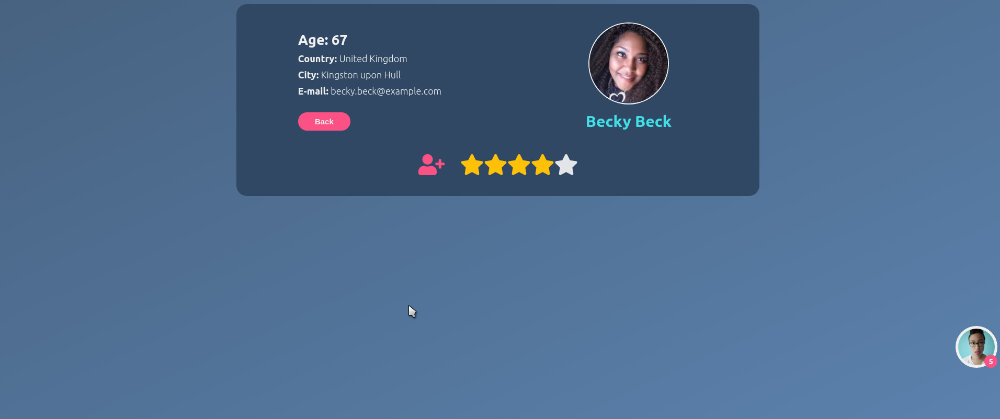

# React API app with Hooks and Context - Looking for a date

This application allow you search your other half that can be male or female. If you find a person that you like it, add that person to favorite bookmark or just rate the person. In the favorite panel you have the ability to manage people by removing them or can check details about the person you are interested in by clicking the "More" button. You will find personal details where he/she lives, age, e-mail. If you have not rated this person before, you can do it there as well.

### Technologies used in project

- React (hooks - useContext), Fetch API
- Sass

### Installation

To install all dependencies just run in console:

```
$ npm install
```

### Start live server

To run application in localhost:

```
$ npm start
```

## How it works...

### Select a gender.



After you select a gender you will see fetched data from outer free API for generating random user data that is call randomuser.me

### Rate the person



The application allows you to rate people, if you add stars, the application will remember your rating when the same person is displayed again

### Add favorite person to bookmark



If any person you like to add as a favorite you can do it by pressing an icon in the right corner. If you want to add the same person twice, the application will not allow to do that.

### Favorite panel



Favorite panel allow to mange people that were added to this bookmark also data are added to local storage in case when browser will be close or refresh and we don't wanna lose a persons that we added. Panel allow you to see more personal details or delete that person.

### More details



More details allow you see personal information about were the person lives, age, email. From details you can rate person and add to favorite panel.
